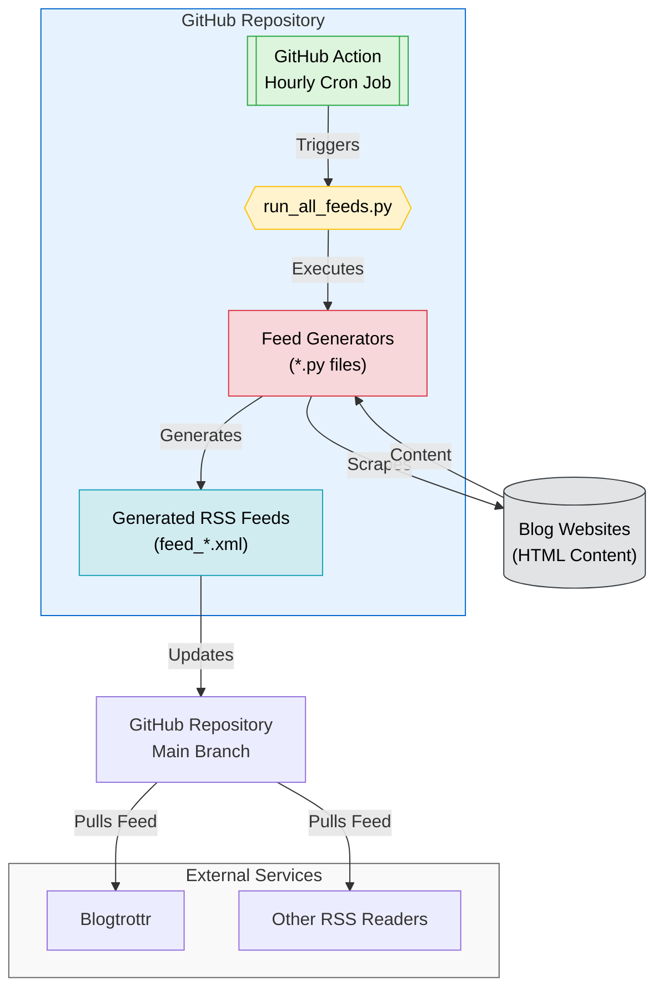

# RSS Feed Generator <!-- omit in toc -->

> [!NOTE]
> Read the blog post about this repo: [No RSS Feed? No Problem. Using Claude to automate RSS feeds.](https://olshansky.substack.com/p/no-rss-feed-no-problem-using-claude)

## tl;dr Available RSS Feeds <!-- omit in toc -->

| Blog                                                              | Feed                                                                                                                             |
| ----------------------------------------------------------------- | -------------------------------------------------------------------------------------------------------------------------------- |
| [Anthropic News](https://www.anthropic.com/news)                  | [feed_anthropic.xml](https://raw.githubusercontent.com/Olshansk/rss-feeds/main/feeds/feed_anthropic.xml)                         |
| [Anthropic Engineering](https://www.anthropic.com/engineering)    | [feed_anthropic_engineering.xml](https://raw.githubusercontent.com/Olshansk/rss-feeds/main/feeds/feed_anthropic_engineering.xml) |
| [Anthropic Research](https://www.anthropic.com/research)          | [feed_anthropic_research.xml](https://raw.githubusercontent.com/Olshansk/rss-feeds/main/feeds/feed_anthropic_research.xml)       |
| [Ollama Blog](https://ollama.com/blog)                            | [feed_ollama.xml](https://raw.githubusercontent.com/Olshansk/rss-feeds/main/feeds/feed_ollama.xml)                               |
| [Paul Graham's Article](https://www.paulgraham.com/articles.html) | [feed_paulgraham.xml](https://raw.githubusercontent.com/Olshansk/rss-feeds/main/feeds/feed_paulgraham.xml)                       |
| [OpenAI Research News](https://openai.com/news/research/)         | _planned_                                                                                                                        |
| [Patrick Collison's Blog](https://patrickcollison.com/culture)    | _planned_                                                                                                                        |
| [Supabase Blog](https://supabase.com/blog)                        | _planned_                                                                                                                        |

### What is this?

You know that blog you like that doesn't have an RSS feed and might never will?

🙌 **You can use this repo to create a RSS feed for it!** 🙌

## Table of Contents <!-- omit in toc -->

- [Quick Start](#quick-start)
  - [Subscribe to a Feed](#subscribe-to-a-feed)
  - [Request a new Feed](#request-a-new-feed)
  - [Create a new a Feed](#create-a-new-a-feed)
- [For Developers 👀 only](#for-developers--only)
  - [Project Tools](#project-tools)
- [Star History](#star-history)
- [How It Works](#how-it-works)

## Quick Start

### Subscribe to a Feed

- Go to the [feeds directory](./feeds).
- Find the feed you want to subscribe to.
- Use the **raw** link for your RSS reader. Example:

  ```text
    https://raw.githubusercontent.com/Olshansk/rss-feeds/main/feeds/feed_ollama.xml
  ```

- Use your RSS reader of choice to subscribe to the feed (e.g., [Blogtrottr](https://blogtrottr.com/)).

### Request a new Feed

Want me to create a feed for you?

[Open a GitHub issue](https://github.com/Olshansk/rss-feeds/issues/new?template=request_rss_feed.md) and include the blog URL.

If I do, consider supporting my 🌟🧋 addiction by [buying me a coffee](https://buymeacoffee.com/olshansky).

### Create a new a Feed

See [Project Tools](#project-tools) for details.

In short: you use Claude to create a Python script that converts a blog's HTML into a `feed_*.xml` file (see existing scripts in `feed_generators/`).

GitHub Actions will run your script automatically once it's committed

## For Developers 👀 only

- Open source and community-driven 🙌
- Simple Python + GitHub Actions 🐍
- AI tooling for easy contributions 🤖
- Learn and contribute together 🧑‍🎓
- Streamlines the use of Claude, Claude Projects, and Claude Sync

### Project Tools

- **GitHub Copilot Workspace:** Used for some PRs ([label: copilot](https://github.com/Olshansk/rss-feeds/pulls?q=label%3Acopilot+)).
- **Claude Projects:**

  - Converts blog HTML to RSS via Python scripts.
  - [Instructions](https://support.anthropic.com/en/articles/9517075-what-are-projects):

    - Parse blog HTML → Python script → `feed_*.xml` (see `feed_generators/`)
    - Scripts run via GitHub Actions
    - If you can't parse the HTML, ask for a sample or explain the issue

- **Claude Sync:** [ClaudeSync repo](https://github.com/jahwag/ClaudeSync?tab=readme-ov-files) keeps project files in sync.

## Star History

[](https://star-history.com/#Olshansk/rss-feeds&Date)

## How It Works


