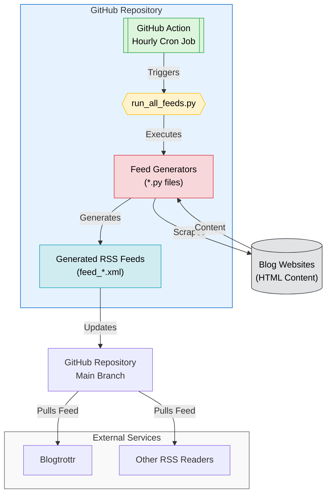

# RSS Feed Generator <!-- omit in toc -->

> [!NOTE]
> [Blog post about this repo](https://olshansky.substack.com/p/no-rss-feed-no-problem-using-claude)

Easily create and maintain RSS feeds for blogs that don't offer them.

- Open source and community-driven 🙌
- Simple Python + GitHub Actions 🐍
- AI tooling for easy contributions 🤖
- Learn and contribute together 🧑‍🎓

## Table of Contents <!-- omit in toc -->

- [Quick Start](#quick-start)
- [Available RSS Feeds](#available-rss-feeds)
- [Request a Feed](#request-a-feed)
- [Contribute a Feed](#contribute-a-feed)
- [Project Tools](#project-tools)
- [Star History](#star-history)
- [How It Works](#how-it-works)

## Quick Start

**Subscribe to a feed:**

- Find feeds in the [feeds directory](./feeds).
- Use the **raw** link for your RSS reader.

Example (Ollama Blog):

```text
https://raw.githubusercontent.com/Olshansk/rss-feeds/main/feeds/feed_ollama.xml
```

Use any RSS reader (e.g., [Blogtrottr](https://blogtrottr.com/)), or add to your inbox.

## Available RSS Feeds

| Blog                                                              | Feed                                                                                                       |
| ----------------------------------------------------------------- | ---------------------------------------------------------------------------------------------------------- |
| [Ollama Blog](https://ollama.com/blog)                            | [feed_ollama.xml](https://raw.githubusercontent.com/Olshansk/rss-feeds/main/feeds/feed_ollama.xml)         |
| [Paul Graham's Article](https://www.paulgraham.com/articles.html) | [feed_paulgraham.xml](https://raw.githubusercontent.com/Olshansk/rss-feeds/main/feeds/feed_paulgraham.xml) |
| [Anthropic News](https://www.anthropic.com/news)                  | [feed_anthropic.xml](https://raw.githubusercontent.com/Olshansk/rss-feeds/main/feeds/feed_anthropic.xml)   |
| [OpenAI Research News](https://openai.com/news/research/)         | _(coming soon)_                                                                                            |

**Planned:**

- 👨 [Patrick Collison's Blog](https://patrickcollison.com/culture)
- 💽 [Supabase Blog](https://supabase.com/blog)

## Request a Feed

Want a feed for a blog?

[Open a GitHub issue](https://github.com/Olshansk/rss-feeds/issues/new?template=request_rss_feed.md) and include the blog URL.

## Contribute a Feed

To add a new feed:

- See [Project Tools](#project-tools) for details.
- In short: write a Python script that converts a blog's HTML into a `feed_*.xml` file (see existing scripts in `feed_generators/`).
- GitHub Actions will run your script automatically.

## Project Tools

- **GitHub Copilot Workspace:** Used for some PRs ([label: copilot](https://github.com/Olshansk/rss-feeds/pulls?q=label%3Acopilot+)).
- **Claude Projects:**

  - Converts blog HTML to RSS via Python scripts.
  - [Instructions](https://support.anthropic.com/en/articles/9517075-what-are-projects):

    - Parse blog HTML → Python script → `feed_*.xml` (see `feed_generators/`)
    - Scripts run via GitHub Actions
    - If you can't parse the HTML, ask for a sample or explain the issue

- **Claude Sync:** [ClaudeSync repo](https://github.com/jahwag/ClaudeSync?tab=readme-ov-files) keeps project files in sync.

## Star History

[](https://star-history.com/#Olshansk/rss-feeds&Date)

## How It Works


