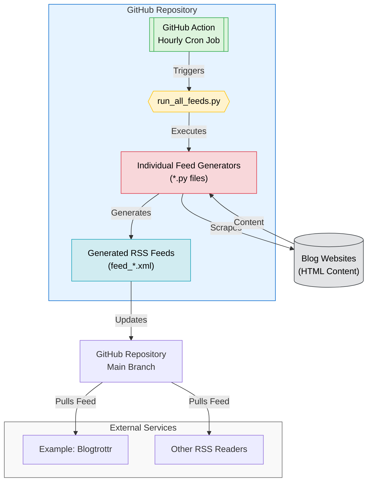

# RSS Feeds <!-- omit in toc -->

This repository provides RSS feeds for blogs and websites that do not offer a default RSS feed. It allows users to subscribe to updates using raw feed links.

- [How do I subscribe?](#how-do-i-subscribe)
- [Which RSS feeds are available?](#which-rss-feeds-are-available)
- [How do I request a new RSS feed?](#how-do-i-request-a-new-rss-feed)
- [How do I contribute a new feed?](#how-do-i-contribute-a-new-feed)
- [What did I use to make this?](#what-did-i-use-to-make-this)
  - [GitHub Copilot Workspace](#github-copilot-workspace)
  - [Claude Projects](#claude-projects)
  - [Claude Sync](#claude-sync)
- [Star History](#star-history)
- [How does this work?](#how-does-this-work)

## How do I subscribe?

To subscribe to an RSS feed, use the raw link of the feed file.

You can find all available feeds in the [feeds directory](./feeds).

For example, to subscribe to the Ollama Blog feed, use the following link:

```url
https://raw.githubusercontent.com/Olshansk/rss-feeds/main/feeds/feed_ollama.xml
```

## Which RSS feeds are available?

- [Ollama Blog](https://ollama.com/blog): [Ollama RSS feed](https://raw.githubusercontent.com/Olshansk/rss-feeds/refs/heads/main/feeds/feed_ollama.xml)
- [Paul Graham's Article](https://www.paulgraham.com/articles.html): [Paul Graham RSS feed](https://raw.githubusercontent.com/Olshansk/rss-feeds/refs/heads/main/feeds/feed_paulgraham.xml)

Coming soon:

- [Patrick Collison's Blog](https://patrickcollison.com/culture)
- [Supabase Blog](https://supabase.com/blog)

## How do I request a new RSS feed?

If you would like to request a new RSS feed for a blog, please use our GitHub issue template. Make sure to provide the link to the actual blog.

[Request a new RSS feed](https://github.com/Olshansk/rss-feeds/issues/new?template=request_rss_feed.md)

## How do I contribute a new feed?

To contribute a new feed, refer to the [Claude Projects](#claude-projects) section. It provides detailed instructions on how to convert HTML files into Python scripts that generate RSS feeds.

## What did I use to make this?

### GitHub Copilot Workspace

_Link: [GitHub Copilot Workspace](https://copilot-workspace.githubnext.com/)_

GitHub Copilot Workspace is still in preview (as of 01/2025), so I can't share the workspace.

However, I've attached the `copilot` label to all PRs generated by GitHub Copilot.

You can access them [here](https://github.com/Olshansk/rss-feeds/pulls?q=label%3Acopilot+).

### Claude Projects

_Link: [Claude Projects](https://support.anthropic.com/en/articles/9517075-what-are-projects)_

I can't share the project (feature is not available as of 01/2025), so I'll share the details.

The knowledge of the project includes files from this repository.

The instructions are:

```text
The goal of this project is to generate rss (feed.xml) files from web pages (*.html) that contain blogs or updates but do not provide a subscribe button or a default RSS feed.

Here is the expected flow and instructions:

1. You will be given an HTML file that needs to be parsed and understood.

2. You will provide a python script that writes a `feed_{}.xml` file that is RSS feed compatible.

3. The `{}` in `feed_{}.xml` will refer to the name of a particular RSS feed.

4. GitHub actions will take care of triggering this periodically, so you don't have to worry about it

5. If you are not given an HTML file that you can parse into an rss feed, either ask for it or explain what the issue with the provided file is.
```

### Claude Sync

Link: [Claude Sync](https://github.com/jahwag/ClaudeSync?tab=readme-ov-files)

I use `ClaudeSync` to sync all the files in this directory with the Project's knowledge.

## Star History

[](https://star-history.com/#Olshansk/rss-feeds&Date)

## How does this work?


